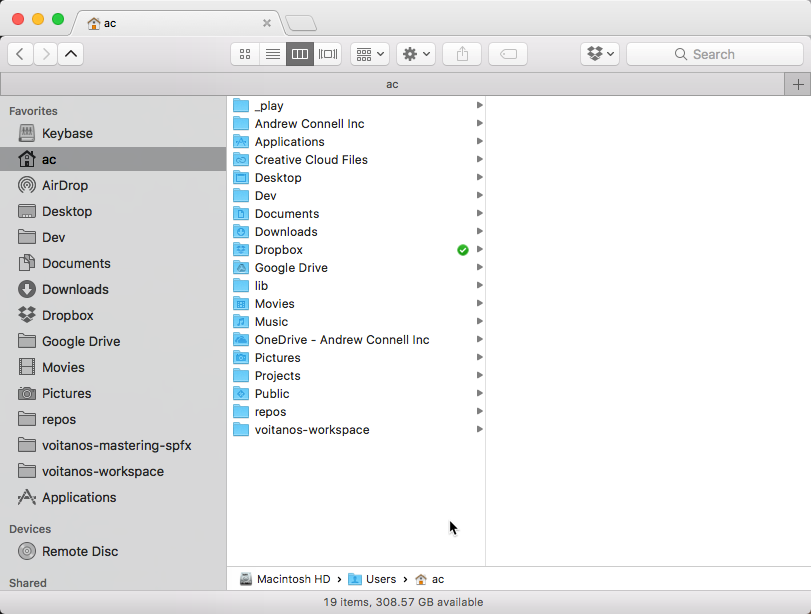
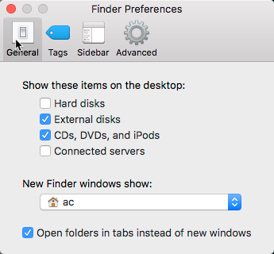
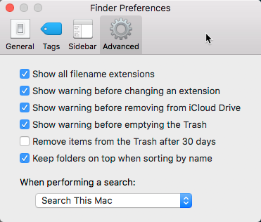
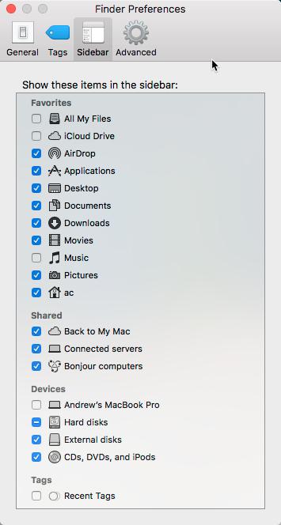
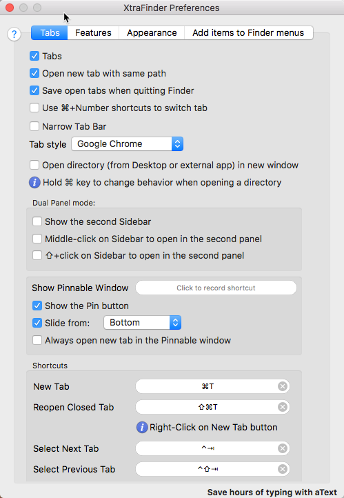
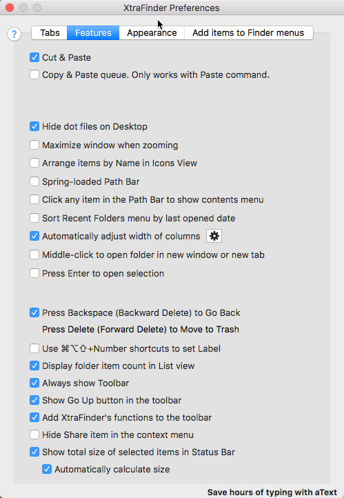
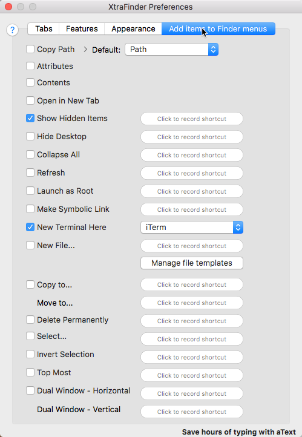

# XtraFinder Installation

### Part 1 —
Temporarily disable System Integrity Protection `csrutil` feature applied by macOS 10.12 Sierra and macOS 10.13 High Sierra.

1. Reboot to recovery OS: reboot & hold `Command` + `R`
2. Select **Utilities** => **Terminal**
3. Enter `csrutil disable`
4. Restart

### Part 2 —
Install XtraFinder

1. Install Xtrafinder (app-settings/XtraFinder.dmg)[app-settings/XtraFinder.dmg]

### Part 3 —
Reenable System Integrity Protection `csrutil` feature applied by macOS 10.12 Sierra and macOS 10.13 High Sierra.

1. Reboot to recovery OS: reboot & hold `Command` + `R`
2. Select **Utilities** => **Terminal**
3. Enter `csrutil enable`
4. Restart

## Screenshots

### Finder Layout —
  

### Finder Settings —
  

  

  

### XtraFinder Settings —
  
    
  
    
  

